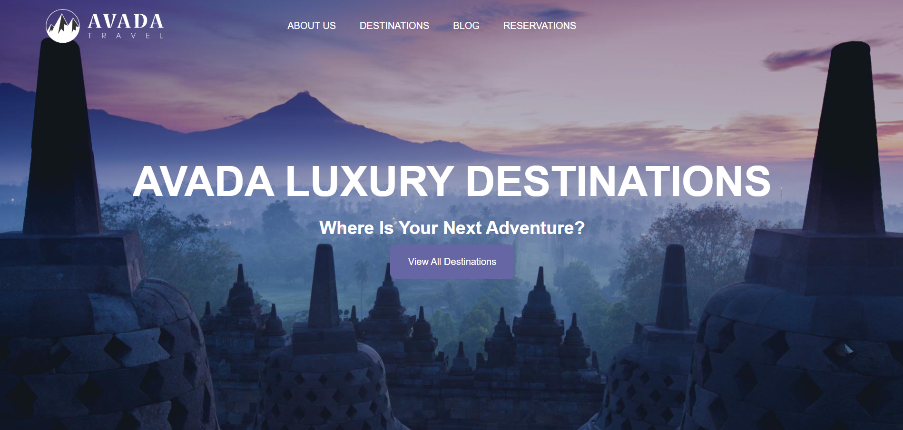
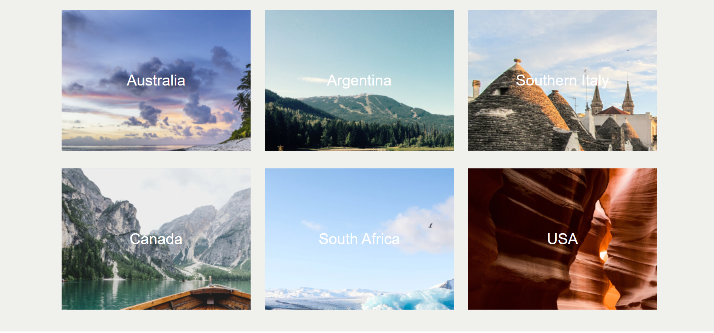
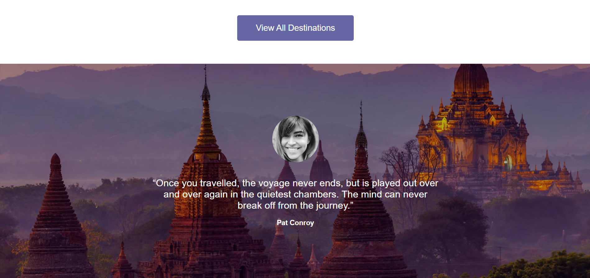

# Travel Website
*A modern and responsive travel website project.*

[Demo Project](https://zarimovahedi-dev.github.io/travel/)

- Developed by Zahra Movahedifar
- Created – 2026-02-27
- Technologies Used – HTML, CSS
- Role – Frontend

- How to reach me:
-
-
-
